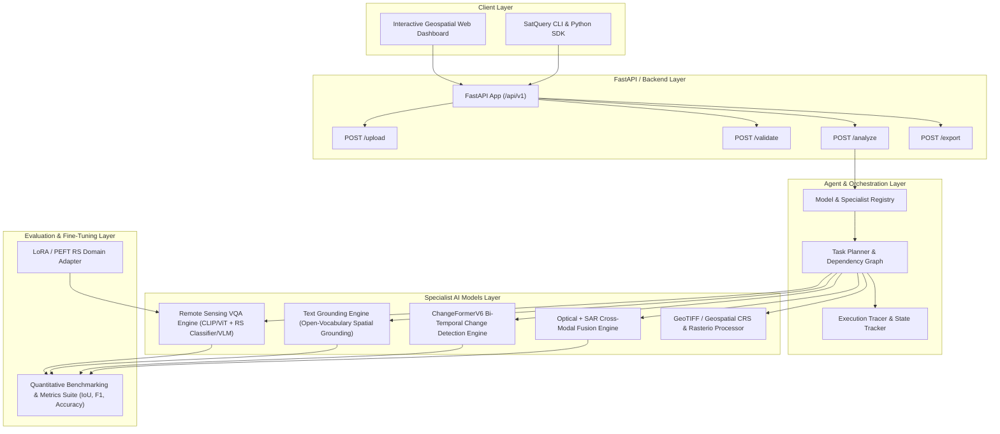

# SatQuery AI — Comprehensive Implementation & Deployment Plan

SatQuery AI is an interactive, multimodal remote-sensing AI system designed to solve complex Earth Observation problems (SIH26167). This plan details the end-to-end execution of all 12 roadmap phases to deliver a production-ready, academically rigorous, and fully verified solution.

---

## User Review Required

> [!IMPORTANT]
> **GPU & Hardware Acceleration**: We have detected a local NVIDIA GeForce GTX 1650 GPU with CUDA enabled. All vision-language, change-detection, and fusion models are configured with device-fallback logic (`cuda` -> `cpu` with automatic mixed precision `fp16` when on GPU, and `fp32` on CPU).

> [!NOTE]
> **API Architecture**: We will provide dual-mode serving:
> 1. FastAPI high-performance asynchronous REST API (`/api/v1/...`) with OpenAPI/Swagger docs at `/docs`
> 2. Interactive Full-Featured Geospatial Web Dashboard (HTML5/Vanilla CSS/ES6 modules + Leaflet/OpenLayers canvas overlays for bi-temporal and multispectral side-by-side inspection).

---

## Architecture Overview



---

## Proposed Changes Across All 12 Phases

### Phase 1: Core AI Models Upgrade

#### 1. Remote Sensing VQA Engine (`satquery/models/vqa.py`)
- Implement a zero-shot/few-shot Remote Sensing Vision Question Answering engine with CLIP/SigLIP/ViT feature extraction and an RS classification/QA head.
- Support scene recognition, numerical/count questions, object presence, land-use queries, and change inquiries.
- Implement true softmax logit confidence calculation and attention map extraction for visual explanation.

#### 2. Text Grounding Engine (`satquery/models/grounding.py`)
- Implement text-to-region visual grounding for remote-sensing imagery.
- Generate bounding boxes (`[ymin, xmin, ymax, xmax]`), pixel heatmaps/masks, and label tags.
- Support queries such as *"Where is the airport?"*, *"Locate the solar farm"*, *"Find water bodies"*, *"Identify storage tanks"*.
- Compute genuine spatial grounding confidence scores based on detection activations.

#### 3. Change Detection Upgrade (`satquery/models/change_detection.py`)
- Enhance `ChangeFormerV6` pipeline with automatic spatial alignment, bicubic/nearest-neighbor multi-scale resampling, difference visualization, and change mask contour segmentation.
- Calculate pixel area, percentage change, cluster bounding boxes, and cluster classification (e.g., new construction, vegetation loss, water encroachment).
- Derive calibrated confidence from output softmax margin probabilities.

---

### Phase 2: Optical + SAR Cross-Modal Fusion

#### 4. Optical + SAR Processing (`satquery/models/optical_sar.py` & `satquery/preprocessing/sar.py`)
- Auto-detect optical vs. SAR modalities using spectral histogram analysis and polarization signatures (VV/VH bands).
- Handle speckle filtering (Lee/Frost filter approximation), dynamic range dB scaling, and co-registration.
- Implement cross-modal feature fusion:
  - Optical evidence: Spectral NDVI/vegetation indices, true color textures.
  - SAR evidence: Dielectric roughness, double-bounce urban backscatter, water specular reflection.
  - Fusion rule: Calibrated weighted fusion with agreement/disagreement metrics.

---

### Phase 3: GeoTIFF & Geospatial Pipeline

#### 5. GeoTIFF / CRS Engine (`satquery/preprocessing/geotiff.py`)
- Full integration with `rasterio` and `shapely` for reading CRS (Coordinate Reference System), affine transforms, bounds, resolution, and multi-band metadata.
- Convert pixel bounding boxes to geographic coordinates (Latitude/Longitude, WGS84, UTM).
- Implement spatial intersection checking for paired images to ensure valid geographic overlap before running change detection.
- Export results as GeoTIFF with preserved georeferencing and GeoJSON spatial polygons.

---

### Phase 4: Agent & Model Registry

#### 6. Model & Tool Registry (`satquery/agent/registry.py`)
- Create an extensible `ModelRegistry` specifying:
  - Model capabilities, input requirements (1 image, 2 images, optical, SAR, GeoTIFF), device support, memory footprints, and expected output schema.
- Implement dynamic capability matching and validation.

#### 7. Upgraded Agent Controller (`satquery/agent/controller.py` & `planner.py`)
- Multi-step execution planning:
  1. Input validation & geospatial alignment
  2. Modality identification
  3. Dynamic task decomposition (e.g. "Detect changes and ground newly built structures")
  4. Multi-model execution in optimal dependency order
  5. Multi-evidence aggregation and confidence synthesis
  6. Explainable execution trace logging

---

### Phase 5: Model Training & Fine-Tuning

#### 8. LoRA / PEFT Training Pipeline (`satquery/training/train_lora.py`)
- Implement a PyTorch + HuggingFace PEFT LoRA fine-tuning script tailored for Remote Sensing Vision-Language adaptation.
- Include data loading, dataset splitting (Train/Val/Test), loss computation, LoRA rank configuration, checkpoint saving, and evaluation hooks.

---

### Phase 6: Quantitative Evaluation Framework

#### 9. Benchmarking Framework (`satquery/evaluation/benchmark.py`)
- Evaluation metrics implementation:
  - **Change Detection**: Overall Accuracy, Precision, Recall, F1-Score, Intersection over Union (IoU).
  - **VQA**: Top-1 Accuracy, Exact Match, BLEU/F1 for descriptive responses.
  - **Grounding**: Average Precision (AP@50), Mean IoU (mIoU), Pointing Accuracy.
  - **Performance**: Latency (ms), Throughput (FPS), GPU VRAM utilization, Memory peak.
- Generate automated Markdown and JSON evaluation summary reports.

---

### Phase 7: Scientific Confidence & Explainability

#### 10. Multi-Modal Confidence Derivation (`satquery/agent/confidence.py`)
- Replaces static confidence with multi-factor uncertainty estimation:
  - Softmax entropy / margin from change detection logits.
  - VQA token probability distributions.
  - Grounding activation peaks.
  - Optical-SAR cross-modal consistency index.

---

### Phase 8 & 9: Frontend & FastAPI Backend

#### 11. FastAPI Endpoints (`satquery/server/fastapi_app.py`)
- Endpoints:
  - `GET /api/v1/health`
  - `GET /api/v1/samples`
  - `POST /api/v1/upload`
  - `POST /api/v1/validate`
  - `POST /api/v1/analyze`
  - `GET /api/v1/result/{task_id}`
  - `POST /api/v1/export/report`
  - `POST /api/v1/export/geojson`

#### 12. Dashboard (`frontend/`)
- Upgraded UI featuring:
  - Multi-image upload / Sample dataset selector (LEVIR-CD, DSIFN, Custom, SAR pairs)
  - Interactive split-slider / side-by-side comparison view
  - Dynamic bounding box and change mask overlay toggles
  - Visual evidence tabs (Change Mask, Overlay, Feature Maps, SAR fusion)
  - Model execution trace with step-by-step reasoning and confidence breakdown
  - One-click PDF/Markdown/GeoJSON export

---

### Phase 10: Automated Testing Suite

#### 13. Comprehensive Tests (`tests/`)
- `tests/test_vqa.py` — Single-image, numerical, object recognition queries
- `tests/test_grounding.py` — Text-to-bounding box localization and coordinates
- `tests/test_change_detection.py` — ChangeFormer inference, alignment, mask generation
- `tests/test_optical_sar.py` — Modal separation, feature extraction, fusion
- `tests/test_geotiff.py` — GeoTIFF reading, CRS transformation, pixel-to-geo mapping
- `tests/test_agent_planner.py` — Task planning, registry, multi-step execution
- `tests/test_fastapi_server.py` — Complete REST API endpoint validation

---

### Phase 11 & 12: Deployment, Docker & Documentation

#### 14. Docker & Deployment (`Dockerfile`, `docker-compose.yml`)
- Multi-stage container build with GPU/CPU support and lightweight runtime.

#### 15. Documentation & Final Project Report (`README.md`, `docs/`)
- Complete `README.md` with system architecture diagrams, quickstart guide, API documentation, and benchmark comparison table.
- Comprehensive technical report in `docs/FINAL_PROJECT_REPORT.md`.

---

## Verification Plan

### Automated Tests
```powershell
& "d:\ChangeFormer\.venv\Scripts\python.exe" -m unittest discover -s tests -p "test_*.py"
```

### Manual Verification
- Launch FastAPI + Web UI on `http://localhost:8080`.
- Test real LEVIR change detection with visual overlays.
- Test VQA on remote sensing aerial imagery.
- Test Text Grounding for locating land structures.
- Test Optical + SAR multi-modal fusion.
- Inspect GeoTIFF metadata extraction and GeoJSON spatial export.
- Verify API docs at `http://localhost:8080/docs`.
